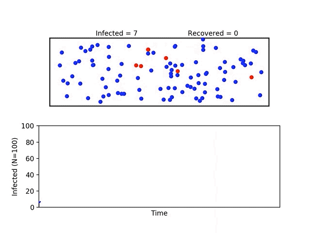

# Covid-19 Simulation

This project is inspired by Washington Post article: [Why outbreaks like coronavirus spread exponentially, and how to “flatten the curve”](https://www.washingtonpost.com/graphics/2020/world/corona-simulator/?itid=hp_no-name_hp-in-the-news%3Apage%2Fin-the-news). 

In this project, the user can change various parameters to study the effects of 
* quarantine 
* social distancing
* recovery

In the following plots,
* red markers = infected
* blue markers = not infected
* black markers = recovered

### No quarantine or social distancing (life as normal)

### Porous quarantine (since a city can never be fully locked down)

### Minimal social distancing (25% of population obeying)

### Effective social distancing (75% of population obeying)

## Getting Started

Requirements:
* python3
* numpy
* matplotlib

## Playing around
The simulation parameters are set in the `modules\simulation_param.py`

List of parameters
1) `N`: Population size
2) `R`: Recovery rate from onset of infection (in number of steps)
3) `S`: Size of human used for collision computation (try to match marker size in matplotlib)
4) `init_state`: array of Nx7 state matrix. Each row is a state vector `[x,y,u,v,infection_status,t0_infected, distancing_mode]`
  * `x,y` 2D position
  * `u,v` 2D velocity
  * `infection_status` 0 = not infected, 1 = recovered, 2 = infected
  * `t0_infected` time at first infection
  * `distancing_mode` 0 = not distancing, 1 = distancing
5) `walls`: array of Mx4 matrix. Each row is 2 points defining the wall face in the form `[x1,y1,x2,y2]`
  * `x,y` are coordinates
  
 ### A note on collision computation
For 2 mobile humans (i.e., humans not observing social distancing) collision is implemented using perfectly elastic collision.

For collision against immobile human (i.e., human observing social distancing), the mass of the immobile human is assumed to be infinte. Effectively, it is similar to collison against a wall.

For elastic collison refer to [Wikipedia](https://en.wikipedia.org/wiki/Elastic_collision)
